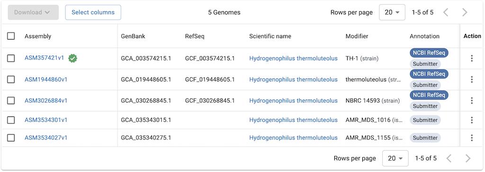

# NCBI Genome
- これまであったNCBI Genome　https://www.ncbi.nlm.nih.gov/genome は終了。NCBI Assemblyと一緒になってNCBI Datasets　のゲノムセクション https://www.ncbi.nlm.nih.gov/datasets/genome/ に移行した(2024年6月)。

## FTPサイト
- https://ftp.ncbi.nlm.nih.gov/genomes/

## 微生物のゲノム
- https://www.ncbi.nlm.nih.gov/datasets/genome/?taxon=297 (2024/6/28)

- Assembly IDとGenBankとRefSeqとある。
   - Assembly ID：ASM357421v1
   - RefSeq：GCF_003574215.1
   - GenBank：GCA_003574215.1 （よく見たら、GCFとGCAの後ろは同じ数字だ）
- FTPサイトのデータ例：https://ftp.ncbi.nlm.nih.gov/genomes/refseq/bacteria/Hydrogenophilus_thermoluteolus/
- FTPサイトにもgenbankとrefseqディレクトリがあって、各々の情報が入っている
   - assembly_summary_(refseq|genbank).txtとassembly_summary_(refseq|genbank)_historical.txt があって、概略がまとまっているのかと思う。
   - 中身については https://ftp.ncbi.nlm.nih.gov/genomes/README_assembly_summary.txt を参考のこと
- その各々に、bacteriaやfungiのディレクトリが切られている。
- その中に学名ごとにディレクトリが切られている（多すぎてなかなか表示されない）
- 中身
```
Parent Directory                               -   
all_assembly_versions/    2024-06-27 11:32    -   
latest_assembly_versions/ 2024-06-27 11:32    -   
representative/           2024-06-26 21:39    -   
annotation_hashes.txt     2024-06-25 18:26  866   
assembly_summary.txt      2024-06-25 18:59  2.1K  
```
```
# Assemblyごとの中身
Parent Directory                                                              -   
GCF_003574215.1_ASM357421v1/                             2024-06-27 02:46    -   
GCF_019448605.1_ASM1944860v1/                            2024-06-27 05:20    -   
GCF_030268845.1_ASM3026884v1/                            2024-06-27 09:23    -   
```
```
# 各ディレクトリの中身
Parent Directory                                                                             -   
GCF_003574215.1_ASM357421v1_ani_contam_ranges.tsv                       2024-01-14 02:05   38K  
GCF_003574215.1_ASM357421v1_ani_report.txt                              2024-01-14 02:05  1.9K  
GCF_003574215.1_ASM357421v1_assembly_report.txt                         2022-08-30 10:37  1.5K  
GCF_003574215.1_ASM357421v1_assembly_stats.txt                          2021-12-16 17:44  6.7K  
GCF_003574215.1_ASM357421v1_cds_from_genomic.fna.gz                     2024-02-13 09:28  737K  
GCF_003574215.1_ASM357421v1_feature_count.txt                           2024-02-13 09:28  1.1K  
GCF_003574215.1_ASM357421v1_feature_table.txt.gz                        2024-02-13 09:28  102K  
GCF_003574215.1_ASM357421v1_genomic.fna.gz                              2020-12-18 23:51  653K  
GCF_003574215.1_ASM357421v1_genomic.gbff.gz                             2024-02-13 09:28  1.6M  
GCF_003574215.1_ASM357421v1_genomic.gff.gz                              2024-02-13 09:28  191K  
GCF_003574215.1_ASM357421v1_genomic.gtf.gz                              2024-02-13 09:28  237K  
GCF_003574215.1_ASM357421v1_protein.faa.gz                              2024-02-13 09:28  460K  
GCF_003574215.1_ASM357421v1_protein.gpff.gz                             2024-02-13 09:28  1.2M  
GCF_003574215.1_ASM357421v1_rna_from_genomic.fna.gz                     2022-12-25 09:56  5.0K  
GCF_003574215.1_ASM357421v1_translated_cds.faa.gz                       2024-02-13 09:28  526K  
README.txt                                                              2024-04-11 16:11   54K  
annotation_hashes.txt                                                   2024-02-13 09:28  410   
assembly_status.txt                                                     2024-06-27 02:46   14   
md5checksums.txt                                                        2024-02-13 09:28  1.1K  
uncompressed_checksums.txt                                              2024-06-12 01:58  698   
```

## ゲノムの統計値を得る
- 数える程度ならウェブで結果を見てもいいし、NCBI Datasets（[使い方のメモ書き](https://github.com/chalkless/lifesciDB/tree/master/ncbi_datasets)）を見てもよい。
- 大量に情報を得たい時はNCBI GenomeのFTPサイトから表をダウンロードしてparseするのがいいと思う。
```
# Bacteriaの場合
https://ftp.ncbi.nlm.nih.gov/genomes/refseq/assembly_summary_refseq.txt
https://ftp.ncbi.nlm.nih.gov/genomes/refseq/bacteria/assembly_summary.txt
```
- 中身
```
$ grep 003574215 assembly_summary.txt 
GCF_003574215.1 PRJNA224116     SAMD00115820    na      reference genome        297 297      Hydrogenophilus thermoluteolus  strain=TH-1     na      latest  Complete Genome      Major   Full    2018-06-21      ASM357421v1     Department of Biotechnology, The University of Tokyo GCA_003574215.1 identical       https://ftp.ncbi.nlm.nih.gov/genomes/all/GCF/003/574/215/GCF_003574215.1_ASM357421v1 na      assembly from type material  na      haploid bacteria        2288780 2288780 61.500000       2       2   2
        NCBI RefSeq     GCF_003574215.1-RS_2024_12_13   2024-12-13      2242    214562       na
```
- 中身の説明：[https://ftp.ncbi.nlm.nih.gov/genomes/README_assembly_summary.txt](https://ftp.ncbi.nlm.nih.gov/genomes/README_assembly_summary.txt)
