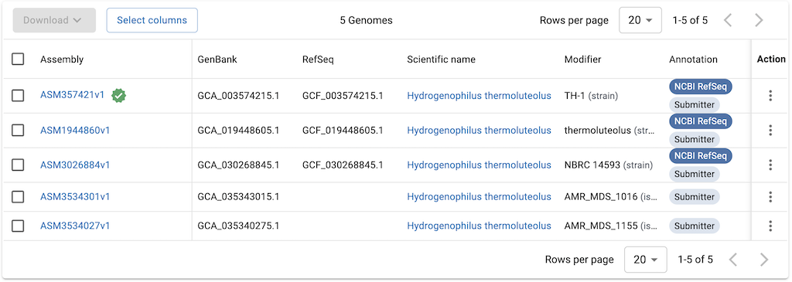

# NCBI Datasets
- https://www.ncbi.nlm.nih.gov/datasets/
- NCBI GenomeとNCBI AssemblyにNCBI Taxonomyをくっつけたりしてできたサイト
- NCBI Genomeのサイトのキャプチャー（Assembly、Genome　（GenBank, RefSeq） のイメージ）
  
- アナウンス：https://ncbiinsights.ncbi.nlm.nih.gov/2023/10/18/ncbi-datasets-access-sequence-data/

## Command-line tool
- https://www.ncbi.nlm.nih.gov/datasets/docs/v2/command-line-tools/download-and-install/
- 上記サイトから説明書き

> The NCBI Datasets command-line tools (CLI) are datasets and dataformat.
>
> Use datasets to download biological sequence data across all domains of life from NCBI.
>
> Use dataformat to convert metadata from JSON Lines format to other formats.
>
> For more information about our tools, please refer to our How-to guides.


### Download
- condaを利用する場合
```
conda install -c conda-forge ncbi-datasets-cli
```
```
# このように書いてもよい
conda install conda-forge::ncbi-datasets-cli
```
- ソースをダウンロードする場合
```
$ curl -o datasets 'https://ftp.ncbi.nlm.nih.gov/pub/datasets/command-line/v2/linux-amd64/datasets'
$ curl -o dataformat 'https://ftp.ncbi.nlm.nih.gov/pub/datasets/command-line/v2/linux-amd64/dataformat'
$ chmod +x datasets dataformat
```
- 詳細と最新情報：https://www.ncbi.nlm.nih.gov/datasets/docs/v2/command-line-tools/download-and-install/

### 使ってみる
- それぞれ コマンドだけ（datasets　だけ）打ってもヘルプが出るし、datasets summary --help とやるともう少し細かいヘルプが出る
#### datasets summary genome
- datasets summary genome accession
```
$ datasets summary genome accession GCF_003574215
{"reports": [{"accession":"GCF_003574215.1","annotation_info":{...
```
詳細は[example.summary_genome_accesssion.json](example.summary_genome_accesssion.json)

- datasets summary genome taxon
```
$ datasets summary genome taxon 297
{"reports": [{"accession":"GCF_003574215.1","annotation_info":{"method":...
```
詳細は[example.summary_genome_taxon.json](example.summary_genome_taxon.json)

種名などでも行けるが、他のものに当たるとどれ? とエラーが出るので、Taxon IDが確実（か、これでTaxon IDを確認してから）。" "で囲っているけど効いていない気もする
```
$ datasets summary genome taxon "Hydrogenophilus themoluteolus"
Error: The taxonomy name 'Hydrogenophilus themoluteolus' is not exact. Try using one of the suggested taxids:
unclassified Hydrogenophilus (no-rank, taxid: 2640443)
Desulfobacter hydrogenophilus (species, taxid: 2291)
Geobacter hydrogenophilus (species, taxid: 40983)
Hydrogenobacter hydrogenophilus (species, taxid: 35835)
Hydrogenophilus (genus, taxid: 70774)
Hydrogenophilus sp. (species, taxid: 2871696)
Hydrogenophilus thermoluteolus (species, taxid: 297)
Hydrogenophilus thiooxidans (species, taxid: 2820326)
Hydrogenophilus phage vB_LmoS_C996 (species, taxid: 2863842)

Use datasets summary genome taxon <command> --help for detailed help about a command.
```


#### datasets download
```
$ datasets download genome accession GCF_003574215
Collecting 1 genome record [================================================] 100% 1/1
Downloading: ncbi_dataset.zip    672kB valid zip structure -- files not checked
Validating package [================================================] 100% 4/4
$ unzip ncbi_dataset.zip 
Archive:  ncbi_dataset.zip
  inflating: README.md               
  inflating: ncbi_dataset/data/assembly_data_report.jsonl        ←　ゲノム配列のメタデータ（他のDBのIDとかアセンブルのソフトとか生物名とか）
  inflating: ncbi_dataset/data/GCF_003574215.1/GCF_003574215.1_ASM357421v1_genomic.fna      ←　ゲノム配列のFASTAファイル
  inflating: ncbi_dataset/data/dataset_catalog.json      ←　他の2つのファイルの説明書き
$ cat ncbi_dataset/data/assembly_data_report.jsonl 
{"accession":"GCF_003574215.1","annotationInfo":{"method":"Best-placed reference protein set; GeneMarkS-2+","name":"NCBI Prokaryotic Genome Annotation Pipeline (PGAP)","pipeline":"NCBI Prokaryotic Genome Annotation Pipeline (PGAP)","provider":"NCBI RefSeq","releaseDate":"2024-02-13","softwareVersion":"6.6","stats":{"geneCounts":{"nonCoding":62,"proteinCoding":2148,"pseudogene":21,"total":2231}}},"assemblyInfo":{"assemblyLevel":"Complete Genome","assemblyMethod":"Velvet v. 1.2.08","assemblyName":"ASM357421v1","assemblyStatus":"current","assemblyType":"haploid","bioprojectAccession":"PRJDB6915","bioprojectLineage":[{"bioprojects":[{"accession":"PRJDB6915","title":"Hydrogenophilus thermoluteolus TH-1 Genome sequencing"}]}],"biosample":{"accession":"SAMD00115820","attributes":[{"name":"sample_name","value":"H_thermoluteolus"},{"name":"collection_date","value":"missing"},{"name":"env_broad_scale","value":"not applicable"},{"name":"env_local_scale","value":"hot spring"},{"name":"env_medium","value":"soil around hot spring"},{"name":"geo_loc_name","value":"Japan:Shizuoka, Izu peninsula"},{"name":"isol_growth_condt","value":"http://www.nbrc.nite.go.jp/NBRC2/NBRCCatalogueDetailServlet?ID=NBRC&CAT=00014978"},{"name":"lat_lon","value":"missing"},{"name":"locus_tag_prefix","value":"HPTL"},{"name":"num_replicons","value":"missing"},{"name":"project_name","value":"Hydrogenophilus thermoluteolus TH-1 genome sequencing"},{"name":"ref_biomaterial","value":"missing"},{"name":"strain","value":"TH-1"},{"name":"type-material","value":"type strain of Hydrogenophilus thermoluteolus"}],"bioprojects":[{"accession":"PRJDB6915"}],"collectionDate":"missing","description":{"comment":"Keywords: GSC:MIxS;MIGS:6.0","organism":{"organismName":"Hydrogenophilus thermoluteolus","taxId":297},"title":"Hydrogenophilus thermoluteolus strain TH-1"},"geoLocName":"Japan:Shizuoka, Izu peninsula","lastUpdated":"2022-04-05T05:55:03.000","latLon":"missing","models":["MIGS.ba"],"owner":{"name":"Department of Biotechnology, The University of Tokyo"},"package":"MIGS.ba.6.0","projectName":"Hydrogenophilus thermoluteolus TH-1 genome sequencing","publicationDate":"2018-06-20T00:00:00.000","sampleName":"H_thermoluteolus","status":{"status":"live","when":"2018-06-26T01:00:56.673"},"strain":"TH-1","submissionDate":"2018-06-26T01:00:56.670"},"pairedAssembly":{"accession":"GCA_003574215.1","annotationName":"Annotation submitted by Department of Biotechnology, The University of Tokyo","status":"current"},"refseqCategory":"representative genome","releaseDate":"2018-06-21","sequencingTech":"454 GS FLX Titanium; ABI 3730","submitter":"Department of Biotechnology, The University of Tokyo"},"assemblyStats":{"contigL50":1,"contigN50":2223143,"gcCount":"1410666","gcPercent":61.5,"genomeCoverage":"42.0x","numberOfComponentSequences":2,"numberOfContigs":2,"numberOfScaffolds":2,"scaffoldL50":1,"scaffoldN50":2223143,"totalNumberOfChromosomes":2,"totalSequenceLength":"2288780","totalUngappedLength":"2288780"},"averageNucleotideIdentity":{"bestAniMatch":{"ani":93.07,"assembly":"GCA_019049855.1","assemblyCoverage":86.47,"category":"type","organismName":"Hydrogenophilus thiooxidans","typeAssemblyCoverage":85.5},"category":"type","comment":"Assembly is the type_strain, mismatch is within genus and expected","matchStatus":"below_threshold_mismatch","submittedOrganism":"Hydrogenophilus thermoluteolus","submittedSpecies":"Hydrogenophilus thermoluteolus","taxonomyCheckStatus":"OK"},"checkmInfo":{"checkmMarkerSet":"Hydrogenophilaceae","checkmMarkerSetRank":"family","checkmSpeciesTaxId":297,"checkmVersion":"v1.2.2","completeness":70.72,"completenessPercentile":100.0,"contamination":8.24},"currentAccession":"GCF_003574215.1","organism":{"infraspecificNames":{"strain":"TH-1"},"organismName":"Hydrogenophilus thermoluteolus","taxId":297},"pairedAccession":"GCA_003574215.1","sourceDatabase":"SOURCE_DATABASE_REFSEQ","typeMaterial":{"typeDisplayText":"assembly from type material","typeLabel":"TYPE_MATERIAL"}}
```

- 何も指定しないとncbi_dataset.zipがダウンロードされる。変更するには`--filename string`をつける(例：--filename datasets.GCF_003574215.zip)。でも展開するとncbi_datasetsディレクトリが作成されるので上書き注意
- .jsonl ファイルはdataformatコマンドでタブ区切りに変換できる（例：[example.assembly_data_report.tab](example.assembly_data_report.tab)） 
```
$ dataformat tsv genome --inputfile assembly_data_report.jsonl
Assembly Accession      ANI Best ANI match ANI  ANI Best ANI match Assembly     ANI Best ANI match Assembly Coverage    ANI Best ANI match Type Category        ANI Best ANI matc...
GCF_003574215.1 93.07   GCA_019049855.1 86.47   type    Hydrogenophilus thiooxidans     85.5    below_threshold_mismatch        type    OK      Assembly is the type_strain, mism...
GCF_003574215.1 93.07   GCA_019049855.1 86.47   type    Hydrogenophilus thiooxidans     85.5    below_threshold_mismatch        type    OK      Assembly is the type_strain, mism...
GCF_003574215.1 93.07   GCA_019049855.1 86.47   type    Hydrogenophilus thiooxidans     85.5    below_threshold_mismatch        type    OK      Assembly is the type_strain, mism...
GCF_003574215.1 93.07   GCA_019049855.1 86.47   type    Hydrogenophilus thiooxidans     85.5    below_threshold_mismatch        type    OK      Assembly is the type_strain, mism...
GCF_003574215.1 93.07   GCA_019049855.1 86.47   type    Hydrogenophilus thiooxidans     85.5    below_threshold_mismatch        type    OK      Assembly is the type_strain, mism...
...
```
- zipを展開しなくても変換は可能：`$ dataformat tsv genome --package GCF_003574215.datasets.zip`
- 目的の列だけ出力する場合は`--fields strings`を使う。stringsにはカラム名をカンマ区切りで指定する ... ヘルプ：[help.dataformat.tsv.genome.txt](help.dataformat.tsv.genome.txt)

#### datasets summary taxon
```
$ datasets summary taxonomy taxon "Hydrogenophilus thermoluteolus"
{"reports": [{"query":["Hydrogenophilus thermoluteolus"],"taxonomy":{"classification":{"class":{"id":2008785,"name":"Hydrogenophilia"},"family":{"id":206349,"name":"Hydrogenophilaceae"},"genus":{"id":70774,"name":"Hydrogenophilus"},"order":{"id":119069,"name":"Hydrogenophilales"},"phylum":{"id":1224,"name":"Pseudomonadota"},"species":{"id":297,"name":"Hydrogenophilus thermoluteolus"},"superkingdom":{"id":2,"name":"Bacteria"}},"counts":[{"count":5,"type":"COUNT_TYPE_ASSEMBLY"}],"current_scientific_name":{"authority":"Hayashi et al. 1999","name":"Hydrogenophilus thermoluteolus"},"genomic_moltype":"dsDNA","group_name":"proteobacteria","has_type_material":true,"parents":[1,131567,2,1224,2008785,119069,206349,70774],"rank":"SPECIES","tax_id":297}}],"total_count": 1}
```

#### datasets download taxonomy taxon
```
$ datasets download taxonomy taxon "Hydrogenophilus thermoluteolus" --filename Hthermoluteolus.zip
Downloading: Hthermoluteolus.zip    2.46kB valid zip structure -- files not checked
Validating package [================================================] 100% 4/4
$ unzip Hthermoluteolus.zip
...
$ ls -alF ncbi_dataset/data/
合計 20
drwxrwxr-x 2 chalkless chalkless 4096  6月 28 11:59 ./
drwxrwxr-x 3 chalkless chalkless 4096  6月 28 11:59 ../
-rw------- 1 chalkless chalkless  337  6月 27 22:58 dataset_catalog.json
-rw------- 1 chalkless chalkless  706  6月 27 22:58 taxonomy_report.jsonl
-rw------- 1 chalkless chalkless  577  6月 27 22:58 taxonomy_summary.tsv
```
